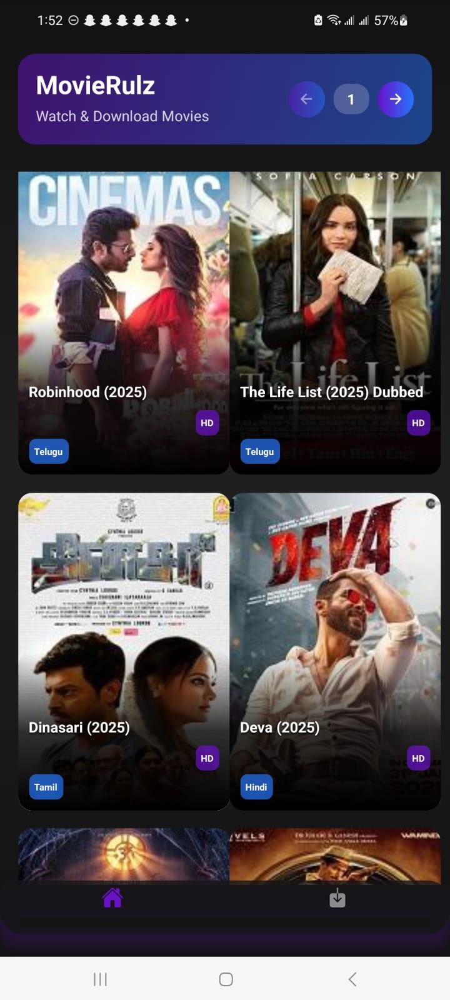
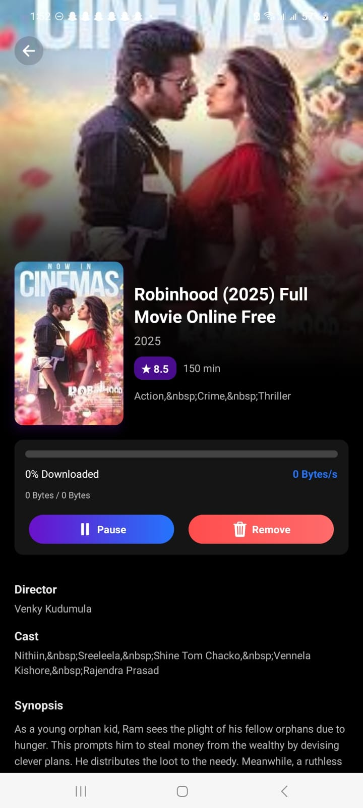
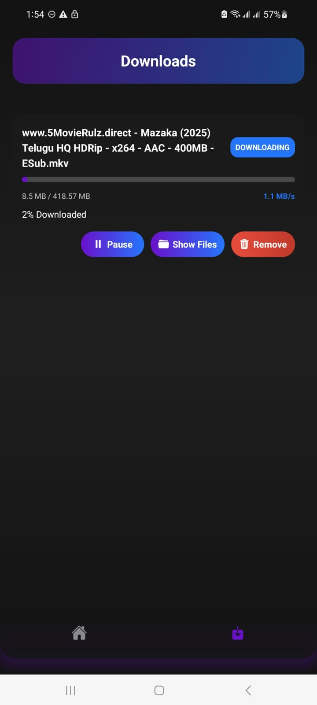

# Movie Rulz Torrent Downloader


[MovieRulz-TorrentDownloader.apk]()







Movie Rulz Torrent Downloader is a cutting-edge torrent client built with a combination of Kotlin, React Native, Expo, and jlibtorrent. This project leverages the jlibtorrent JNI bindings to provide a seamless torrent downloading experience across various Android architectures.

## Overview

This project is an Expo app that utilizes React Native packages and is built using Gradle. It integrates the powerful jlibtorrent libraries, including the primary jar containing the Java classes and several platform-specific jars containing the JNI binary libraries.

## jlibtorrent Integration

The following jlibtorrent jars are used in the project:

- **Core Library:** `jlibtorrent-${jlibtorrent_version}.jar`
- **Android JNI Libraries:**
  - `jlibtorrent-android-arm-${jlibtorrent_version}.jar`
  - `jlibtorrent-android-arm64-${jlibtorrent_version}.jar`
  - `jlibtorrent-android-x86-${jlibtorrent_version}.jar`
  - `jlibtorrent-android-x86_64-${jlibtorrent_version}.jar`

These jars must be placed in the project's `libs` folder. They provide the required native libraries for different Android architectures (armeabi-v7a, arm64-v8a, x86, x86_64).

## Setup and Build Instructions

### Gradle Build Configuration

In your `android/build.gradle`, add the following dependency implementations in the **dependencies** section:

```gradle
implementation files("libs/jlibtorrent-${jlibtorrent_version}.jar")
implementation files("libs/jlibtorrent-android-arm-${jlibtorrent_version}.jar")
implementation files("libs/jlibtorrent-android-arm64-${jlibtorrent_version}.jar")
implementation files("libs/jlibtorrent-android-x86-${jlibtorrent_version}.jar")
implementation files("libs/jlibtorrent-android-x86_64-${jlibtorrent_version}.jar")
```

This configuration ensures that all required jlibtorrent jars are included in your project build.

### Main Application Setup

In your `MainApplication.kt`, import the torrent package by adding:

```
packages.add
```

Additionally, in the `torrent/TorrentModule.kt`, import all the necessary libraries. This Kotlin module implements the torrent functionality for the client.

### Building the Project

* **Android Build:** Use `gradlew` to build your project. This will compile the project along with the integrated jlibtorrent libraries.
* **Other Platforms:** Note that if you are planning to extend support for desktop operating systems (Windows, Linux, macOS), you might need to extract the native shared libraries (`.dll`, `.so`, or `.dylib`) from their respective jars and add them to the folder specified by your `java.library.path`.

For more examples and usage, please refer to the [FrostWire jlibtorrent demo repository](https://github.com/frostwire/frostwire-jlibtorrent/tree/master/src/test/java/com/frostwire/jlibtorrent/demo).

## Contribution

This is the first version of Movie Rulz Torrent Downloader and it is released as open source. As stated:

> "if we are not making it as a business, we open source it, anyone can contribute and keep the repo alive forever"

We welcome contributions from the community to improve and extend the functionality of this torrent downloader. Whether it’s fixing bugs, adding new features, or enhancing performance, your contributions are highly valued.

## License

This project is open source. Please refer to the LICENSE file for more details on how you can use and contribute to this project.

## Acknowledgements

A big thank you to the developers behind jlibtorrent and the FrostWire community for providing invaluable resources and inspiration.
